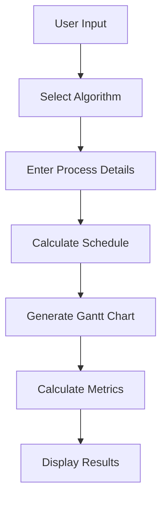
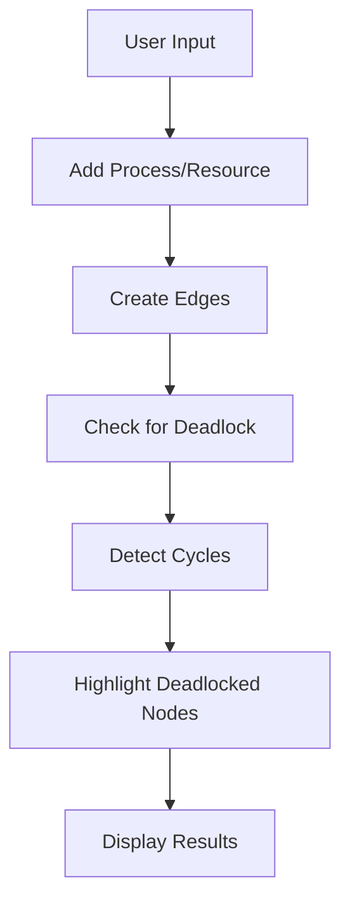

# Interactive Web-Based OS Simulator

A comprehensive web-based operating system simulator that demonstrates various OS concepts including process scheduling algorithms and deadlock detection through interactive visualizations.

## Features

- **Process Scheduling Algorithms**
  - First-Come-First-Serve (FCFS)
  - Shortest Job First (SJF)
  - Priority Scheduling
  - Round Robin Scheduling
  - Interactive Gantt chart visualization
  - Performance metrics calculation

- **Resource Allocation Graph (RAG) Simulator**
  - Interactive graph visualization
  - Process and resource management
  - Request and allocation edge creation
  - Deadlock detection with cycle analysis
  - Visual feedback for deadlocked nodes
  - Modern and intuitive user interface
  - Real-time graph updates
  - Clear visual distinction between processes and resources

## Tech Stack

### Frontend
- HTML5 & CSS3
- JavaScript (ES6+)
- [Vis.js](https://visjs.org/) - For interactive graph visualization
- [Tailwind CSS](https://tailwindcss.com/) - For responsive UI design
- Modern UI components and animations

### Backend
- Python 3.x
- Flask - Web framework
- NetworkX - For graph operations and deadlock detection
- Matplotlib - For Gantt chart generation

## Project Structure

```
Interactive-Web-Based-OS-Simulator/
├── app.py                  # Main Flask application
├── graph.py               # Graph generation utilities
├── vercel.json            # Vercel configuration
├── static/
│   ├── css/
│   │   └── style.css      # Custom styles
│   └── js/
│       ├── index.js       # Main JavaScript logic
│       ├── algorithm.js   # Algorithm-specific logic
│       └── rag.js         # RAG simulator logic
├── templates/
│   ├── index.html         # Home page with modern UI
│   ├── program.html       # Algorithm simulation page
│   └── rag.html           # RAG simulator page with enhanced visualization
└── README.md              # Project documentation
```

## UI Features

- **Modern Design**
  - Clean and professional interface
  - Responsive layout for all devices
  - Smooth animations and transitions
  - Intuitive navigation
  - Clear visual hierarchy

- **Interactive Elements**
  - Dynamic graph visualization
  - Real-time updates
  - Hover effects and feedback
  - Clear process/resource distinction
  - Easy-to-use controls

## Flow Diagrams

### Process Scheduling Flow


### RAG Simulator Flow


## Installation

### Local Development

1. Clone the repository:
```bash
git clone https://github.com/yourusername/Interactive-Web-Based-OS-Simulator.git
cd Interactive-Web-Based-OS-Simulator
```

2. Create a virtual environment:
```bash
python -m venv venv
source venv/bin/activate  # On Windows: venv\Scripts\activate
```

3. Install dependencies:
```bash
pip install -r requirements.txt
```

4. Run the application:
```bash
python app.py
```

5. Open your browser and navigate to:
```
http://localhost:5000
```

### Vercel Deployment

1. Install Vercel CLI:
```bash
npm install -g vercel
```

2. Login to Vercel:
```bash
vercel login
```

3. Deploy the project:
```bash
vercel
```

4. For subsequent deployments:
```bash
vercel --prod
```

## Environment Variables

For Vercel deployment, you need to set the following environment variables:

- `PYTHON_VERSION`: Set to `3.9` (or your preferred Python version)
- `FLASK_ENV`: Set to `production`

## Usage

### Process Scheduling
1. Select a scheduling algorithm from the home page
2. Enter the number of processes
3. Input arrival times and burst times for each process
4. Click "Start" to see the simulation
5. View the Gantt chart and performance metrics

### RAG Simulator
1. Add processes and resources using the input fields
2. Create request and allocation edges between processes and resources
3. Click "Check for Deadlock" to analyze the graph
4. View the results and highlighted deadlocked nodes

## Contributing

1. Fork the repository
2. Create your feature branch (`git checkout -b feature/AmazingFeature`)
3. Commit your changes (`git commit -m 'Add some AmazingFeature'`)
4. Push to the branch (`git push origin feature/AmazingFeature`)
5. Open a Pull Request

## License

This project is licensed under the MIT License - see the [LICENSE](LICENSE) file for details.

## Acknowledgments

- [Vis.js](https://visjs.org/) for graph visualization
- [NetworkX](https://networkx.org/) for graph operations
- [Flask](https://flask.palletsprojects.com/) web framework
- [Tailwind CSS](https://tailwindcss.com/) for styling
- [Vercel](https://vercel.com/) for hosting

## Contact

Your Name - [@yourtwitter](https://twitter.com/yourtwitter)

Project Link: [https://github.com/yourusername/Interactive-Web-Based-OS-Simulator](https://github.com/yourusername/Interactive-Web-Based-OS-Simulator)

Live Demo: [https://interactive-os-simulator.vercel.app](https://interactive-os-simulator.vercel.app)